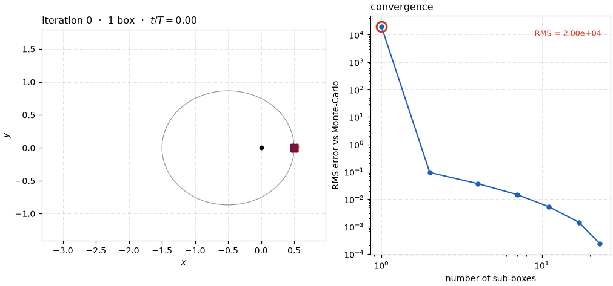
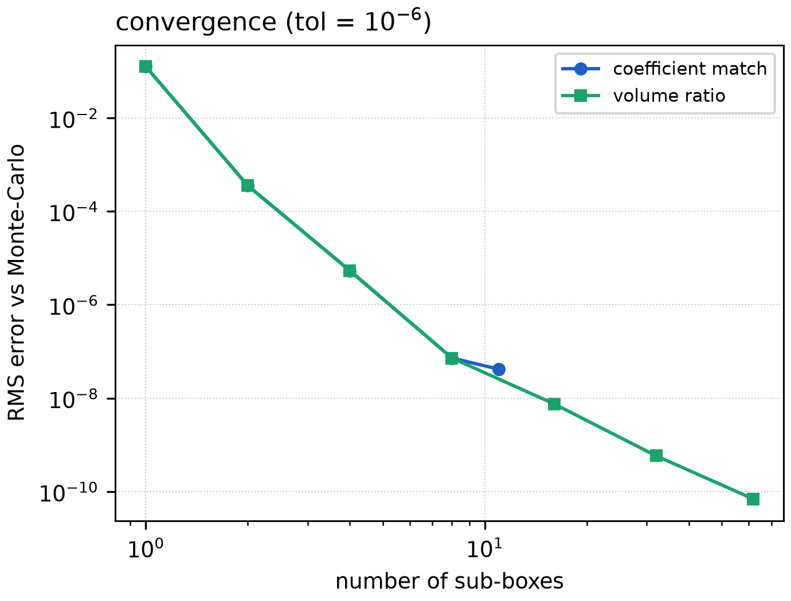

# Parallel ADS by refinement

The [two-body tutorial](two_body.md) showed *classic* Automatic Domain
Splitting: the integrator watches the flow polynomial as it advances and, the
moment the expansion stops converging, **splits the box in flight** and
resumes each half from the split time. It is accurate and frugal, but it is
also *sequential in time* — a box cannot be subdivided until the integration
has reached the point where it goes bad, and each child inherits its parent's
partial state.

This tutorial takes the opposite tack, implemented in
[`tax::ads::refine`](https://github.com/andreapasquale94/tax/tree/main/include/tax/ads/refine.hpp):

> **Always propagate the whole box to the final time first. Only then judge
> its quality — and if it is poor, split the *initial conditions* and try
> again.**

Because every box is carried to `t_final` on its own, with no dependence on
any other box's partial state, the entire refinement is **embarrassingly
parallel**: a box and all of its eventual descendants are independent
propagations that fan out across a thread pool.

It runs on the **same IC box** as the [taylor.cpp / ads.cpp](two_body.md)
examples — varying the initial \(y\) position (\(\pm 8\times10^{-3}\)) and
\(y\) velocity (\(\pm 2\times10^{-2}\)) of the \(e=0.5\) Kepler orbit — so the
figures here line up directly with those.

Source: [`examples/two_body/refine.cpp`](https://github.com/andreapasquale94/tax/tree/main/examples/two_body/refine.cpp)
and [`plot_refine.py`](https://github.com/andreapasquale94/tax/tree/main/examples/two_body/plot_refine.py).

## The idea

Start from one box of initial conditions and propagate it to `t_final`,
yielding a single flow polynomial \(\Phi\). Now ask a sharp question:

> *Does splitting this box change the answer?*

To answer it, bisect the box along some direction, propagate **both halves**
all the way to `t_final` as well, and compare the two children
\(\Phi_L, \Phi_R\) against the parent \(\Phi\). If they agree, the parent was
already faithful — keep it. If they disagree, the parent had drifted past its
radius of convergence — discard it, keep the children, and recurse the same
test on each. Repeat until every surviving box passes, or a maximum depth is
reached.

```cpp
#include <tax/ads.hpp>
#include <tax/ode.hpp>
using namespace tax::ode::methods;

tax::ads::Box< double, 4 > ic_box{ ic_center, half_width };   // (y, vy) active

auto tree = tax::ads::refine< /*P=*/6 >(
    Verner89{},
    tax::ads::CoefficientMatchCriterion{ /*tol=*/1e-6, /*maxDepth=*/8 },
    rhs, ic_box, ic_center, /*t0=*/0.0, /*t1=*/2 * M_PI, cfg, /*n_threads=*/8 );

for ( int li : tree.done() )
{
    const auto& leaf = tree.leaf( li );   // leaf.box, leaf.depth, leaf.payload
}
```

The return type is the same `AdsTree` the classic driver produces, so
everything downstream (point lookup, the merger, the I/O helpers) works
unchanged. The difference is purely *how* the tree was grown.

### Refinement vs. classic ADS

| | Classic ADS (`propagate`) | Refinement (`refine`) |
|---|---|---|
| When a box is split | mid-integration, at the failure time | after a full propagation to `t_final` |
| Child initial state | parent's partial map at the split time | fresh identity on the child sub-box |
| Quality probe | one flow map, inspected in flight | parent **vs. its two children** at `t_final` |
| Cost per box | one integration | three (self + two trial children) |
| Parallelism | independent boxes only | the **whole recursion** fans out |

Refinement deliberately spends more arithmetic — every box pays for two trial
children even if it is ultimately accepted — to buy a propagation pattern with
no time-ordering constraints at all.

## What quality index?

The verdict hinges on the comparison "parent vs. children". Two indices are
shipped in
[`refine_criteria.hpp`](https://github.com/andreapasquale94/tax/tree/main/include/tax/ads/refine_criteria.hpp).

### Coefficient match

Compare the maps directly in coefficient space. Re-identify the parent on a
half-domain — the very same substitution ADS uses to split,
\(\xi_d \to \pm\tfrac12 + \tfrac12\,\xi'_d\) — and compare it term by term to
the independently propagated child:

$$
\delta \;=\; \max_i \;
  \frac{\big\| \Phi^{(i)}\!\restriction_{\text{half}} - \Phi^{(i)}_{\text{child}} \big\|_\infty}
       {\big\| \Phi^{(i)}_{\text{child}} \big\|_\infty} .
$$

While the parent is accurate the restriction reproduces the child and
\(\delta \approx 0\); once it drifts, \(\delta\) grows. It is dimension-free
(`CoefficientMatchCriterion`), needs no geometry, and `tol` is a relative
coefficient error.

### Volume ratio

A *geometric* alternative — and the one that originally motivated this
experiment: when the parent has diverged, its image is badly shaped, so
compare the **size of the image set** before and after a split. The image of
an \(m\)-dimensional box face under the flow map is an \(m\)-manifold in state
space, whose \(m\)-volume is

$$
V \;=\; \int_{[-1,1]^m} \sqrt{\det\!\big(J^\top J\big)}\,\mathrm{d}\xi ,
\qquad J_{i a} = \frac{\partial \Phi_i}{\partial \xi_{a}},
$$

with \(J\) the Jacobian of the output components against the active input
axes, evaluated by a small quadrature grid. The verdict is the ratio

$$
\rho \;=\; \frac{V(\Phi)}{V(\Phi_L) + V(\Phi_R)} .
$$

When the parent is well shaped its children tile it and \(\rho \approx 1\);
stretching or folding past the radius of convergence drives \(\rho\) away from
1 (because \(|\det|\) does **not** cancel over a fold, the measure is robust to
inside-out maps). `VolumeRatioCriterion` accepts when \(|\rho - 1| \le
\texttt{tol}\). For two active axes \(V\) is an image *area*, so this is the
dimension-general form of the original "compare the final area" idea — set
`axes` to the active box dimensions (here \(\{1,3\}\) for \((y, v_y)\)) and it
works for any state-space dimension.

### Comparing the two

Driving the refinement with each index in turn (both at `tol = 1e-6`) tells a
clear story. The split *direction* is the same heuristic for both — the
coordinate carrying the most order-\(P\) coefficient mass — so they make
**identical splits early on** and ride the very same RMS-vs-box-count curve.
They part ways only near convergence: at `tol = 1e-6` the coefficient match is
satisfied at **11 boxes**, while the volume ratio is a stricter gate at that
tolerance and keeps subdividing to **62**:

| | coefficient match | volume ratio |
|---|---|---|
| boxes per iteration | 1, 2, 4, 8, **11** | 1, 2, 4, 8, 16, 32, **62** |
| final RMS vs. Monte Carlo | \(4.2\times10^{-8}\) | \(6.9\times10^{-11}\) |

Neither is "more accurate" per box — both sit on the same curve — they simply
calibrate `tol` against different quantities (a relative coefficient error vs.
a relative set-volume change). The coefficient match is the cheaper, default
choice; the volume ratio is the geometric, dimension-general one when you want
to bound the growth of the reachable set itself. The example uses the
coefficient match to drive the animation.

## Watching it converge

The example sweeps the depth cap \(k = 0, 1, 2, \dots\): iteration 0 is the
single box, and each iteration adds a level of refinement until the partition
stops changing. At every iteration we push every sub-box to `t_final`, draw the
box images along the orbit, and score the piecewise-polynomial prediction
against a 350-point **Monte-Carlo** reference cloud.



Iteration 0 — the lone box — breaks down: by one full period the order-6
polynomial is extrapolating past where it converges, its image folds in on
itself, and the RMS error against Monte Carlo is \(\sim\! 0.13\) (the same
breakdown the single polynomial shows in the [two-body tutorial](two_body.md)).
Two boxes already cut that to \(3.6\times10^{-4}\); each further level
concentrates new splits where the orbit is most nonlinear (the periapsis
re-passage) and the partition closes onto the true set.

The matching improves monotonically with the number of sub-boxes — exactly the
behaviour we want from a refinement scheme — and both quality indices trace the
same curve (right panel of the animation):



| iteration | sub-boxes | RMS vs. Monte Carlo |
|----------:|----------:|--------------------:|
| 0 | 1  | \(1.3\times10^{-1}\) |
| 1 | 2  | \(3.6\times10^{-4}\) |
| 2 | 4  | \(5.3\times10^{-6}\) |
| 3 | 8  | \(7.2\times10^{-8}\) |
| 4 | 11 | \(4.2\times10^{-8}\) |

## Parallelism

Each box is propagated independently of every other, so `refine` runs the
recursion across `num_threads` workers pulling from a shared queue: the
expensive three propagations happen lock-free on copied-out inputs, and the
mutex guards only the queue and the tree mutation. Because the accept/split
decision for a box depends solely on that box and its two trial children — never
on global ordering — the resulting partition is **identical** whether run on one
thread or many (leaves are canonicalised by box center), which the test suite
checks directly.

## Run it yourself

```bash
cmake -S . -B build -DTAX_BUILD_EXAMPLES=ON && cmake --build build -j
cd build/examples
./two_body_refine
python3 ../../examples/two_body/plot_refine.py --data . --out figs
```

Things to try:

- **Switch the index.** The example drives the animation with
  `CoefficientMatchCriterion`; swap in
  `VolumeRatioCriterion{ 1e-6, k, {1, 3}, 8 }` (the two active axes) to refine
  on the geometric set-volume instead.
- **Grow the box** (`kIcBoxHalfWidth` in `examples/two_body/common.hpp`) and
  watch the single polynomial fail harder and the converged leaf count climb.
- **Set `TAX_ADS_THREADS`** and confirm the partition (and every coefficient) is
  bit-for-bit independent of the worker count.
